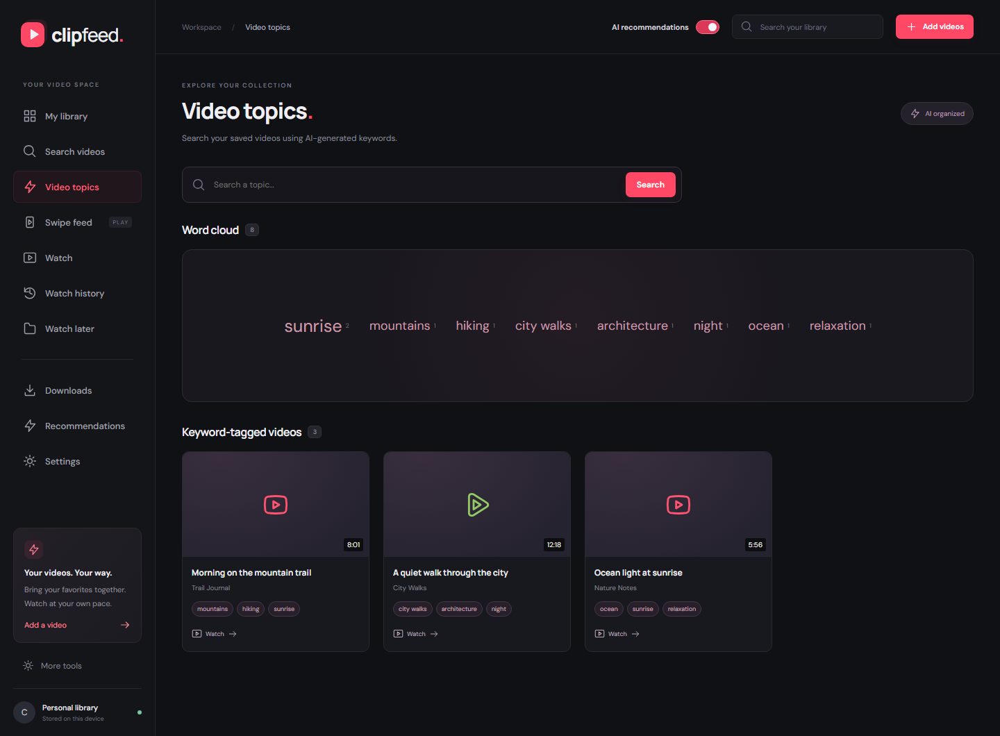
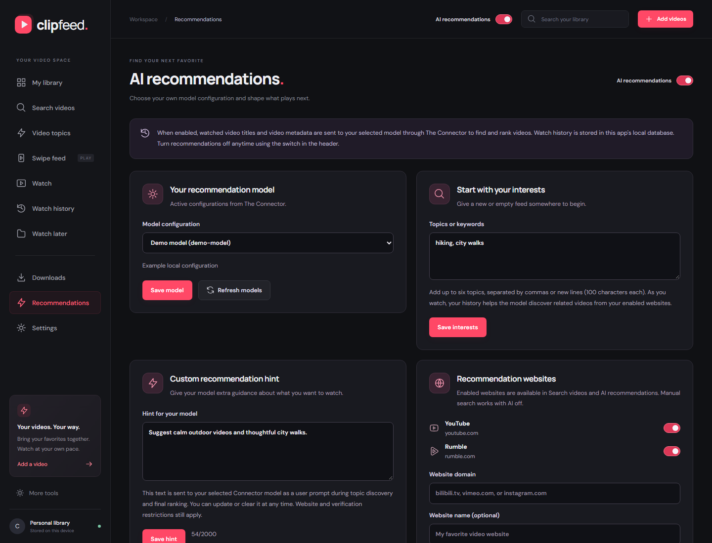
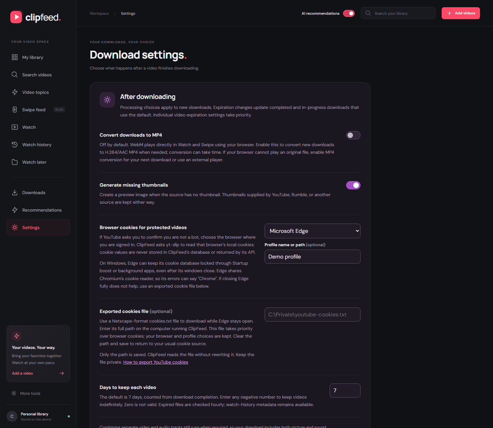

# ClipFeed - your video library, two ways to watch

ClipFeed downloads individual videos through platform connectors and puts them in
one local library. Open a video in a YouTube-style **Watch** view or browse with
up/down swipes in the TikTok-style **Swipe feed**. Both views use custom React
playback controls around an inline HTML video element, without native player
controls or platform embeds.

YouTube and Rumble have dedicated connectors. A generic yt-dlp connector tries
other supported sites. Matching a connector identifies how to handle a URL; it
does not guarantee that the source is downloadable.

## Screenshots

Captured from the running local app with saved videos.

**My library** brings downloaded videos, source filters, search, and playback
choices together.


**Watch** pairs a widescreen video with custom playback controls, video details,
and an Up next list.


**Swipe feed** lets you move between videos vertically while preserving each
video's aspect ratio.


<details>
<summary>Downloads</summary>

**Downloads** shows the queue and completed saved videos. This capture contains
completed downloads.


</details>

**On mobile**, the library, Watch view, and Swipe feed adapt to a narrow screen.

<p>
  
  
  
</p>

**Video topics** groups saved videos by keyword and shows the matching collection.
The following captures use local demo data rather than a personal library.



<details>
<summary>Recommendation and download settings</summary>

**Recommendations** lets you choose a model, set interests, and change the hint
sent to the model.



**Download settings** includes browser-cookie selection and an exported cookie
file option for protected videos.



</details>

## Using the app

The default screen is **My library**. The sidebar also provides **Search videos**, **Video topics**,
**Swipe feed**, **Watch**, **Watch history**, **Watch later**, **Downloads**,
**Recommendations**, and **Settings**. Legacy conversion,
conversion history, and converted-video tools remain under **More tools**.

1. Paste one video URL per line in the library. Use Shift+Enter for another line.
2. Choose Best available, 1080p, 720p, or 480p and select **Add videos**.
3. Follow progress in the library or Downloads. Failed downloads show the reason
   and offer retry or dismissal; active downloads can be cancelled.
4. Open a completed video in Watch or Swipe. The selected player preference is
   remembered in your browser.

To find videos without a link, use the search bar in **My library** or open
**Search videos**. Enter keywords, select a specific provider or **All enabled
websites**, and select **Search**. The provider list includes your enabled custom
websites, managed under **Recommendations → Recommendation websites**. Manual
search works with AI recommendations off and does not require a model. Results
show thumbnails, titles, creators, descriptions, and durations when available; generic
discoveries retain an **Unverified link** label independently of the recommendation
visibility toggle.
Select a download quality and **Add to library** to queue a result, **Watch later**
to save its link, **Save all to Watch later** to keep every visible result, or
**Open original** to view it on its source site. Searching
or saving a link alone does not download videos.
Search queries and platform choices stay in the page URL for refresh and back/forward
navigation. When more matches are available, **Load more links** expands the same
search without treating its first page as repeated. The header's **Search your
library** field filters saved videos.
Turn on **Fetch all links** to collect up to 200 usable same-website video links
from a configured search page instead of the normal bounded selection. The choice
is retained in the search-page URL. The backend then makes a bounded, concurrent
attempt to read each linked page's title and thumbnail metadata. If a title cannot
be fetched, its original search-page label is kept. Lazy-loaded thumbnails found
directly on the search page are also retained for supported provider CDNs.

Online search requires internet access. YouTube and Rumble use their built-in
searches. Custom websites use a configured search URL or an available native
integration. Without either option, keyword search for that website is reported
as unavailable.
Configured search pages may follow up to five same-website HTTPS redirects; every
redirect destination is validated before it is requested, and relative result
links are resolved from the final page URL. Accidental doubled root slashes are
normalized, and a same-site HTTP redirect is retried over HTTPS without sending an
insecure request. Outbound provider URLs and HTTP response statuses are written at
INFO level as `External search request` and `External search response` entries.
A platform failure displays a warning while keeping results from other selected
websites available; failed searches can be retried. Disabled or removed websites
are not searched, and an unavailable selected website prompts you to choose or
enable a provider.

For personalized suggestions, open **Recommendations**, select an active model
configuration from The Connector or upload its `config.json`, and turn on
**AI recommendations**. Add interests or Watch later links to start an empty
library. The model uses local watch history to derive topics and ranks candidates
from website search and your Watch later links. These origins are stored in a
persistent catalog and merged without duplicate videos.
While recommendations are enabled, each completed library download is also sent
to the selected model for 3–12 descriptive keywords based on its title and
description. The keywords are stored locally and appear in **Video topics**, where
the word cloud and text search filter matching saved videos. Enabling recommendations
backfills eligible existing downloads; disabling recommendations stops new AI tagging
without removing keywords already saved.
Presented search and recommendation links are also recorded locally. In
**Settings → Link settings**, you decide which links are repeated: the app never
classifies them merely because they appeared in another session. Use **Mark
repeated** on a search result, recommendation, or recorded-link row, then choose
whether marked links should be hidden. You can also explicitly allow or exclude a
link.
The Recommendations tab has its own **Fetch all links** preference. When enabled,
configured search pages contribute their full collected link set to the local
candidate catalog before verification, exclusion, repeat, and ranking filters are
applied. It is off by default.
In **Recommendation websites**, add domains such as `bilibili.tv`,
`vimeo.com`, or `instagram.com`, and enable or disable each source. YouTube and
Rumble are included by default. Vimeo, Bilibili.tv, and Bilibili.com also use their
own video search. You can set or edit a custom website's optional search URL, such
as `https://vimeo.com/search?q={query}` or the prefix `https://vimeo.com/search?q=`.
It must use HTTPS on that website or a subdomain. The app extracts links and
metadata from public HTML/JSON-LD without running page scripts or signing in.
Turn on **Show unverified links** to include generic search-page and
model-suggested discoveries. They keep an **Unverified link** label. Search
availability and site support vary.
Open **Search details** in the recommendation panel to see which websites found
videos, returned no matches, or could not be searched. Temporary failures can use
recent successful search results. A website's configured search page may still
return no usable videos.
Recommendations default to **All enabled websites**, regardless of the current
video's source. Use the recommendation panel's selector for a specific website;
the **Watch history** list filter does not restrict recommendation sources.
Suggestions also appear in an empty/end-of-list
Swipe feed and alongside Watch's Up next list. Select **Play** for saved videos or
**Download** for new ones. Downloads run independently and stay on the current screen
when they finish. Custom-site downloads use the generic yt-dlp connector and depend
on website support; **Open original** opens a suggestion on its source website.
The header switch turns suggestions off anytime;
they are off by default.

To use video search, downloads, recommendation hints, and library/history tools
from The Connector, expand **The Connector integration** in Recommendations.
Its separate opt-in switch also sends viewing activity to a system session.
See the [Connector integration guide](docs/connector-integration.md) for setup,
filters, in-chat playback, and activity logging.

**Watch later** lets you paste video URLs, add an optional title/description,
import JSON, filter entries by website, or remove saved links. It works with AI
off and does not download videos. Leave the title blank to fetch it in the
background; supplied titles are preserved. The saved list shows **Fetching title**,
updates automatically, and offers **Fetch title** or **Retry title** for existing
untitled entries. Title lookup tries the website's yt-dlp metadata extractor before
page metadata and the optional AI fallback. If all automatic methods
fail, the saved card provides an inline title field. Every saved card also has a
**Play** button: it reuses a ready local copy or downloads the video and opens it in
the Watch player. Saving a video also starts a thumbnail-only background download;
the local thumbnail appears on its card without downloading the video itself. Once
a video download completes, its matching Watch later entry and temporary thumbnail
are removed automatically while the downloaded library item remains. The
**Save all links** reads up to 500 unique HTTP or HTTPS links from one public page and
opens a review window without saving anything first. **Select videos** offers
checkboxes for recognized configured-video links. **Text view** lets you copy all
links, edit them in another application, and paste up to 200 video URLs back for one
bulk Watch later save. The normal title and thumbnail jobs run for those saved videos.
Non-visible script/style text, code-shaped labels, generic labels such as **Video**,
and quality/caption badges such as **1440pCC** are discarded instead of being saved
as titles. Descriptive link labels, image alt text, or a later title link for the
same URL can supply the title. Every saved video offers **Attempt title fetch**
(**Fetch title** for missing titles); the existing label is kept unless lookup
succeeds. Failed attempts offer **Retry title** and manual title entry.
**Archive all page links** remains available in the review window for video and
non-video links; archived links use separate SQLite records and never become
recommendation candidates. Before saving,
the backend manually resolves up to five HTTP
redirects and stores the final canonical URL. Each hop must remain on a configured
public HTTPS video website; redirect loops and unrelated destinations are rejected.
If **AI title fallback** is enabled in Recommendations, the selected Connector model
is tried only after normal metadata lookup fails. AI titles are labeled and do not
verify the video. Explicitly saved links are eligible for
recommendations even with **Show unverified links** off, but saving does not verify
them: **Saved by you** and **Unverified link** can appear together. Their websites
must still be enabled. Removing a save preserves any independently discovered
catalog metadata.

If the model returns no usable picks or fails, **Fallback recommendation mix**
uses random eligible picks: by default **50% website search and 50% Watch later**.
Whole percentages must total 100; a zero excludes that
origin from fallback. Empty or exhausted shares move to other available sources
with positive weights. These percentages do not change a valid model playlist.
Fallback still excludes duplicate, current, recently watched, explicitly excluded,
and disabled-provider videos, and keeps verification labels. See the
[setup, algorithm, catalog, and API guide](docs/recommendations.md).

For JSON imports, the UI accepts an array or this object (up to 200 entries/1 MiB):

```json
{
  "videos": [
    {
      "source_url": "https://www.youtube.com/watch?v=jNQXAC9IVRw",
      "title": "A video to revisit",
      "description": "My notes about this video."
    }
  ]
}
```

For larger lists, run
`python scripts/import_watch_later.py FILE_OR_- [--api URL] [--dry-run] [--no-fetch-titles] [--no-resolve-redirects]` locally.
It accepts UTF-8 JSON from a file or `-` for standard input, checks up to 10,000
entries/16 MiB, and sends batches of at most 200 to the running app. `--api`
defaults to `http://127.0.0.1:8000`; `--dry-run` validates the input without
sending requests. Website and video URLs are validated by the app when imported.
Missing titles are normally fetched after links are saved. Use `--no-fetch-titles`
or send `fetch_titles: false` in an API import to skip these background requests.
Redirects are resolved before each batch is written; `--no-resolve-redirects` or
`resolve_redirects: false` disables that check.
The server accepts JSON metadata, not executable scripts. See the
[import examples](docs/recommendations.md#watch-later-and-json-imports).

Watch-history entries remain after local files expire or are deleted. Those entries
show **Download again**, which queues the original saved source URL without leaving
the history screen.

**AI picks for you** appears beside the Watch player, with a reason for each
suggestion and **Play** or **Download** actions. This screenshot uses the
actual interface with demo recommendation data.


The collection contains your downloaded videos, with real thumbnails and source
metadata when available. Search titles, creators, and URLs; filter by platform;
sort newest first, oldest first, or by title. Heart a video to find it in Liked
videos. Download a saved file to your browser or delete it from the library.

Files and SQLite metadata live on the machine running the backend. Likes and
player preferences use the current browser's local storage. There are no accounts
or cloud synchronization. Copy link copies the original source URL. In-app video routes refer to this
running app and require access to the same backend library.

## Custom players

**Watch** provides a widescreen player, title and creator information, description,
an Up next list, and optional autoplay-next. **Swipe feed** provides a vertical
scroll-snap player with touch, wheel, previous/next buttons, and up/down keyboard
navigation. Only the active feed item plays; landscape videos retain their aspect
ratio inside the vertical presentation.

The shared `CustomVideoPlayer` provides:

- Play/pause, seek timeline, elapsed/total time, and buffered progress.
- Mute and volume controls, plus playback speeds from 0.5x to 2x.
- Fullscreen and picture-in-picture buttons when the browser exposes those APIs.
- Keyboard-accessible controls, loading states, playback errors, and retry.
- Inline playback and muted autoplay fallback when browser autoplay policy requires it.

When the player is focused: Space or K toggles playback, M toggles mute, F toggles
fullscreen, Left/Right seeks five seconds, and J/L seeks ten seconds. Up/Down
adjusts volume in Watch and changes videos in the feed. Touch scrolling moves
between feed items. Autoplay, programmatic volume, fullscreen, and picture-in-picture
availability can differ between browsers and devices.

Fullscreen and picture-in-picture controls use the standard browser APIs when
available and fall back to Safari's native video presentation APIs on iPhone and
iPad. Compact layouts keep both controls visible.

The browser still decodes video using its media APIs; the in-page interface is
custom-designed in `frontend/src/components/CustomVideoPlayer.jsx` and its CSS.

## Quick start

Install Python 3.10+, Node.js 22+ with npm, and FFmpeg with ffprobe on PATH.
FFmpeg must include the `libx264` and AAC encoders. The backend requires
`yt-dlp[default,curl-cffi]>=2026.8.19`; setup installs this requirement.

YouTube extraction uses yt-dlp's EJS scripts and a supported JavaScript runtime.
The `default` extra includes `yt-dlp-ejs`; the connector enables Node and Deno.
Node 22+ satisfies the documented Node runtime requirement. See the official
[yt-dlp dependencies](https://github.com/yt-dlp/yt-dlp#dependencies) and
[EJS setup guide](https://github.com/yt-dlp/yt-dlp/wiki/EJS).

```powershell
# Windows, from the repository root
.\setup.bat
.\run.bat
```

```sh
# Linux / macOS, from the repository root
./setup.sh
./run.sh
```

Setup uses an active Python environment or creates `.venv`, installs the backend
requirements and frontend npm dependencies, and seeds `.env` from `.env.example`.
The requirements retain Whisper and Silero VAD for the legacy converter.

The runner normally starts the frontend at <http://localhost:5173> and backend at
<http://127.0.0.1:8000>, with API docs at `/docs`. If a port is occupied, it selects
another available port and prints the actual URLs. The frontend API proxy targets
the selected backend. Stop both services with Ctrl+C.

### LAN access and custom ports

To use the app from another computer or phone on the same network:

```powershell
.\run_lan.bat
# Choose separate frontend and backend ports:
.\run_lan.bat --frontend-port 5174 --backend-port 8001
# Equivalent command:
.\run.bat serve --lan --frontend-port 5174 --backend-port 8001
```

On Linux/macOS, use `./run.sh serve --lan --frontend-port 5174 --backend-port 8001`.
The `serve` command is optional when calling `run.bat`, `run.sh`, or `run.py` directly.
Port flags also work without `--lan`.

LAN mode listens on all IPv4 interfaces and prints LAN URLs. Open the frontend
URL, such as `http://192.168.1.20:5174`, on the other device. The frontend proxies
API requests, playback, thumbnails, and downloads to the chosen backend port.
LAN devices share the host's library and controls; the app has no authentication.
If the page cannot be reached, allow Node.js (or the frontend TCP port) through
Windows Firewall on your private network and check that Wi-Fi client isolation
is disabled. Direct API access also requires allowing the backend TCP port.

Command-line ports override environment variables and `.env`. Explicit ports must
be different and available; otherwise startup fails with an error. Without port
flags, `FRONTEND_PORT` (default `5173`) and `BACKEND_PORT` (default `8000`) remain
starting ports, with automatic selection of the next available port.

## Connectors and download lifecycle

Platform connectors live under `backend/app/connectors/`. `registry.resolve(url)`
uses the first matching connector: YouTube, Rumble, then generic yt-dlp. The player
and library consume the same `DownloadResult`/`VideoInfo` contract for every source.

For a site already supported by yt-dlp, add a connector such as:

```python
# backend/app/connectors/vimeo.py
from .ytdlp import YtDlpConnector


class VimeoConnector(YtDlpConnector):
    id = "vimeo"
    name = "Vimeo"
    domains = ("vimeo.com",)
```

Then import and insert `VimeoConnector()` before `GenericConnector()` in
`registry.py`'s `CONNECTORS` list. Override `ydl_opts` or `format_for` if the source
needs platform-specific options. For a different download implementation, subclass
`Connector`, implement `download(url, dest_dir, quality, on_progress, cancel)`, and
return a `DownloadResult` with a file inside `dest_dir` and its `VideoInfo`. Report
progress through the callback and honor the cancellation event.

Downloads run in background threads bounded by `MAX_CONCURRENT_DOWNLOADS`. A video
moves through `queued`, `downloading`, `processing`, and `ready`, or ends as `failed`
with an error message. The API hides internal filesystem paths. An interrupted
server restart marks unfinished downloads failed so they can be retried.

The backend validates downloaded media with ffprobe and keeps the original format
by default. WebM files stream directly to the custom Watch and Swipe players with
`video/webm` and byte-range seeking. VP8, VP9, and AV1 video with Opus or Vorbis
audio are recognized for native WebM playback. Actual decoding depends on the
browser and device; see [WebM codec support](https://developer.mozilla.org/en-US/docs/Web/Media/Guides/Formats/Containers#webm).
Playback does not automatically start MP4 conversion.

Open **Settings** to control optional processing for new downloads:

- **Convert downloads to MP4**: off by default. Explicitly enable this and save to
  convert new non-MP4 downloads, including WebM, to H.264/AAC MP4. Compatible MP4
  files pass through. Conversion may take time for large or high-resolution files.
  With the switch off, formats outside the supported browser codec set retain
  their original files and show a notice with an external-download link.
- **Generate missing thumbnails**: turn off to skip creating a preview frame.
  Thumbnails already supplied by the source are kept either way.
- **Browser cookies for protected videos**: choose the browser where you are signed
  in when YouTube requires verification. yt-dlp reads the selected browser/profile
  locally for each new download. Cookie values are not stored in ClipFeed's database
  or returned by its API.
- **Exported cookies file**: enter the full path to a private Netscape-format
  `cookies.txt` file on the computer running the backend. This avoids reading a
  locked Edge cookie database and lets your normal Edge windows stay open. ClipFeed
  stores the path and loads cookies in memory without rewriting the source file.
  A saved path takes priority over `YTDLP_COOKIE_FILE`, which takes priority over
  the selected browser. Clear the field and save to use the environment file again,
  if configured, or your retained browser/profile choice.
- **Video expiration**: defaults to seven days. The deadline is the download's
  `completed_at` timestamp plus the configured number of 24-hour days. Use the
  **Expiration settings** button above the library collection to change the value in
  a modal. Positive values from 1 to 3650 enable expiration; any negative value means
  keep indefinitely and is stored as `-1` in the default settings. A change
  recalculates completed videos and updates in-progress downloads that use the default.
  The gear button on each video
  in **Downloads** opens a dialog to change that video's expiration independently.
  This includes completed videos and queue entries. Any negative whole number keeps
  that video indefinitely; positive days count from download completion, even when
  changed later. Individual choices persist across restarts and take priority over
  later changes to the default. The backend checks at startup, once per
  hour while it is running, and on media access. Expired files are removed while
  watch-history metadata remains available.

Thumbnail generation defaults on. Click **Save settings** to persist choices in SQLite.
Existing installations clear the old default-on conversion setting once, requiring
a fresh opt-in; subsequent choices survive restarts. Thumbnail preferences remain.
Downloads already queued or running keep their original processing choices. Combining
separate source video/audio tracks remains necessary for a complete download.
Legacy on-demand playback conversion also requires opt-in. Explicit conversion and
transcription jobs under More tools keep their separate options.

If Edge reports **Could not copy Chrome cookie database**, "Chrome" refers to
yt-dlp's shared Chromium cookie reader; it does not mean your Edge selection was
ignored. Windows can keep the database locked while Edge is running, including
Startup boost and background apps after you close its windows. Close Edge fully
and retry, or use **Exported cookies file**. Follow yt-dlp's
[YouTube cookie export instructions](https://github.com/yt-dlp/yt-dlp/wiki/Extractors#exporting-youtube-cookies),
save the exported file outside this repository, paste its full path into Settings,
and save before retrying the download. The file contains account credentials, so
keep it private. For YouTube, the upstream instructions describe exporting from a
separate private session and closing that session afterward to prevent cookie
rotation. Refresh the export if its authentication stops working.

Downloads and recommendation buttons show the current preparation step, such as
**Combining video and audio**, **Checking browser compatibility**, or **Converting
for browser playback**. Processing uses an indeterminate progress indicator: the
old fixed 92% was a stage marker, not measured conversion progress. A long 4K
conversion can continue working for some time after the network transfer finishes.

Streaming supports full responses, single byte ranges, suffix ranges, and proper
206/416 responses for seeking. Queued cancellation prevents a download from
starting; active work observes cancellation and stops FFmpeg preparation. Cleanup
runs after an active worker exits. File routes restrict legacy downloads to their
job output directories, and database connections close after each operation.

### Platform limits

- Import individual video links. Playlist and channel results are rejected before
  yt-dlp starts downloading their entries.
- The generic connector delegates to yt-dlp. An HTTP(S) URL can match it even when
  no extractor can download that particular page.
- DRM-protected, private, authenticated, region-restricted, removed, or
  platform-blocked videos are not guaranteed to work. Browser cookies or an exported
  cookie file can supply an existing login; the app does not provide DRM decryption.
- Requested quality is a preference constrained by available source formats and
  the connector's fallback selection.
- Extraction depends on upstream platform behavior. Keep yt-dlp and its matching
  EJS dependencies updated when a platform changes.

## API overview

| Method | Endpoint | Purpose |
|---|---|---|
| GET | `/api/connectors` | List connectors (`id`, `name`, `domains`) |
| GET | `/api/video-keywords?q=` | Return the local word cloud, enrichment status counts, and saved videos filtered by generated keyword |
| GET | `/api/search?q=&source=all&limit=12&fetch_all=false` | Search enabled websites; `fetch_all=true` collects up to 200 usable links from configured search pages instead of the normal 1–24 result page |
| GET / POST | `/api/watch-history` | Read recent history or record actual playback |
| GET / PATCH | `/api/settings/downloads` | Read/update processing and default `retention_days`; expiration changes update current/future downloads without an individual override |
| GET / PATCH | `/api/settings/links` | List recorded links and update whether user-marked repeated links are hidden |
| PATCH | `/api/settings/links/{link_id}` | Set a recorded link state to `silenced` (user-marked repeated), `allowed`, or `excluded` |
| PATCH | `/api/media/{video_id}/retention` | Set this video's `{retention_days}` to 1–3650 or any negative integer for indefinite storage; returns the updated media item |
| GET / PATCH | `/api/recommendations/settings` | Read/update enablement, model, AI-title fallback, interests, unverified visibility, website/search URL settings, and fallback weights |
| GET | `/api/recommendations/models` | Discover active Connector configurations |
| POST | `/api/recommendations/configs` | Validate and import `{name, config}` into The Connector |
| GET | `/api/recommendations/tools` | List metadata and keyword-search function schemas |
| POST | `/api/recommendations/tools/{name}` | Invoke a search tool with `{arguments}` when enabled |
| POST | `/api/recommendations` | Generate an ordered playlist for Feed, Watch, or History, optionally filtered by `source` |
| GET | `/api/recommendations/watch-later?source=all&limit=200&offset=0` | List saved links with pagination as `{items, total, revision}` |
| POST | `/api/recommendations/watch-later` | Save/import `{videos:[{source_url,title?,description?}], fetch_titles?:true, resolve_redirects?:true}` (1–200); return `{items, added, updated, revision}` |
| POST | `/api/recommendations/watch-later/{catalog_id}/title` | Queue/retry a missing title; `?force=true` refreshes an existing title; return `{item, queued}` |
| DELETE | `/api/recommendations/watch-later/{catalog_id}` | Remove Watch later membership; return `{removed, revision}` |
| POST | `/api/resolve` | Route `{urls}` to connectors; does not check download availability |
| POST | `/api/media` | Start downloads with `{urls, quality}`; returns queued items |
| GET | `/api/media` / `/api/media/{id}` | Library list (`?status=`) or item detail |
| DELETE | `/api/media/{id}` | Cancel pending work and remove the item/files |
| GET | `/api/media/{id}/stream` | Seekable playback; 409 until ready |
| GET | `/api/media/{id}/thumbnail` | Thumbnail; 404 if unavailable |
| GET | `/api/media/{id}/download` | File attachment; 409 until ready |
| POST | `/api/media/{id}/conversions/{format}` | Start an on-demand `mp4` or `mp3` conversion |
| GET | `/api/media/{id}/conversions/{format}/download` | Download a completed derived file |
| GET | `/api/media/{id}/conversions/mp4/stream` | Seekable playback of a completed compatible MP4 |
| POST | `/api/convert` | Create legacy job from `{urls, options}` |
| GET | `/api/jobs` / `/api/jobs/{id}` | Legacy job list/detail, including files |
| GET | `/api/jobs/{id}/logs` | Execution log |
| GET | `/api/jobs/{id}/download?file=` | Per-file legacy download |
| GET | `/api/jobs/{id}/download-zip` | Legacy outputs as ZIP |
| GET | `/api/jobs/{id}/videos` / `/api/videos` | Legacy video listing |
| GET | `/api/jobs/{id}/stream?file=` | Legacy playback; 202 while preparing |
| POST | `/api/jobs/{id}/discard` | Abort legacy job and purge its temporary folder |

Media items expose `id`, `source_url`, `connector`, `status`, `progress`, `stage`,
`quality`, available title/creator/duration/dimensions, timestamps, `retention_days`,
`expires_at`, `retention_override` (an individual expiration choice), file size,
`error_message`, `playback_warning`, `stream_url`, `thumbnail_url`, `download_url`,
`file_name`, generated `keywords`, and persistent `conversions` state for MP4 and MP3 outputs.

Routes include `#/library`, `#/library/add`, `#/search`, `#/keywords`, `#/recommendations`, `#/settings`, `#/feed`, `#/feed/<id>`, `#/watch`,
`#/watch/<id>`, `#/watch-history`, `#/watch-later`, `#/downloads`, `#/convert`,
`#/convert/<job-id>`, `#/history`, and `#/videos`.

## Configuration and storage

See `.env.example` for backend options: `BACKEND_HOST`, `BACKEND_PORT`,
`ORIGINAL_PROJECT_DIR`, `JOBS_DB_PATH`, `JOBS_ROOT`, `MEDIA_ROOT`, and
`MAX_CONCURRENT_DOWNLOADS`, `YTDLP_COOKIE_FILE` (optional Netscape cookie file),
and `RECOMMENDATION_CONNECTOR_URL` (default
`http://127.0.0.1:8301`). The runner also accepts `FRONTEND_PORT` as its starting
frontend port.

Downloaded videos, SQLite metadata, and legacy working folders default to the
operating system's temporary directory under `prod_jobs`. On Windows:

- Videos and thumbnails: `%TEMP%\prod_jobs\library`
- Database for jobs, videos, watch history, recommendation catalog, and preferences: `%TEMP%\prod_jobs\jobs.db`
- Legacy working folders: `%TEMP%\prod_jobs\<job-id>`

`JOBS_ROOT` relocates this storage root; `MEDIA_ROOT` and `JOBS_DB_PATH` can override
the media and database locations individually. Unset or empty values use the
defaults. Files remain between app restarts but may be removed by system temporary
file cleanup. Set `JOBS_ROOT` to a durable directory if you want permanent storage.
For an existing installation, stop the app and move `backend/jobs.db` to the new
database location before restarting to retain its library records (do not replace
an existing destination database). The default download concurrency is two.

The recommendation catalog uses `recommendation_websites`, `recommendation_videos`,
`recommendation_video_origins`, and `recommendation_history`. It retains discovery
origins, your saved metadata, and recommendation counts across restarts. Actual
playback history remains separate in `watch_history`.

## Verification

From the repository root on Windows:

```powershell
.venv\Scripts\python.exe -m unittest discover -s tests -v
.venv\Scripts\python.exe -m unittest discover -s backend/tests -v
npm.cmd --prefix frontend run build
npm.cmd --prefix frontend run test:player
npm.cmd --prefix frontend run test:app
npm.cmd --prefix frontend run test:webm
```

On Linux/macOS, use `.venv/bin/python` and `npm` in the same commands.
Browser tests require Chrome, Edge, or Chromium installed locally. Set
`PLAYER_TEST_BROWSER` to the executable path when it cannot be found automatically.
The browser suites cover player behavior, app navigation, Feed/Watch/search,
watch history, recommendations, Watch later, and download settings. They run against isolated
Vite servers and deterministic API/media
fixtures; they do not change your library or download external content.
The `test:webm` suite uses real browser media APIs to decode, play, and seek local
VP9/Opus and AV1/Opus WebM fixtures through `CustomVideoPlayer`; both passed in
Chrome 153. Its fixture-generation commands are recorded in
[`frontend/tests/native-webm.fixtures.md`](frontend/tests/native-webm.fixtures.md).

The offline backend suite uses fake connectors and videos
generated locally with FFmpeg, covering connector routing, playlist rejection,
queued/active cancellation, MP4 codec conversion, thumbnails, library persistence,
API download-to-stream lifecycle, byte-range seeking, and legacy job behavior.
Processing tests cover saved preferences, migration of existing library records,
retaining original files when conversion is off, queued-job settings, optional
thumbnails, and bounded thumbnail failures. Native playback tests cover AV1/VP9
WebM files kept unchanged, explicit MP4 opt-in, MIME types, and byte-range responses.
Search tests cover provider metadata, safe result URLs, query bounds, Rumble query
encoding, HTTP error diagnostics, timeouts, empty results, partial failures, custom
provider selection, and searches with AI recommendations off. Browser checks also
cover custom-provider routes/search URLs, disabled providers, unverified result
labels, search-to-download actions, Watch later imports and saves, fallback
percentages, background title lookup/retry, and stale search responses. Title
polling checks include pagination, failures, source changes, and leaving the page.
Recommendation tests cover model discovery/import, history-to-keywords-to-playlist
generation, tool calling, verified candidates, round-robin search, settings races,
cache reuse, three-source catalog persistence, weighted fallback on model failure
or no usable picks, and disabling pending requests. The import helper is tested
offline for validation, dry runs, file/stdin input, batches, and partial failures.
Model responses are mocked; no paid
provider inference is part of the suite.
It does not download videos from external platforms; live YouTube/Rumble extraction
is not covered by this verification. Browser smoke checks also confirmed custom
playback of existing saved YouTube, Rumble, and generic-source videos, plus
390-pixel mobile layouts, actual touch swipes in both directions, and pausing
offscreen feed videos.

The backend tests ran on Windows with Python 3.14.6, FFmpeg 9.0.1, yt-dlp 2026.8.19,
yt-dlp-ejs 0.8.0, and curl-cffi 0.16.3. Node 24.18.0 and npm 11.16.0 are available in
the same development environment. These record the tested environment, not an
assertion that all other versions have been tested.

## Project layout

```text
backend/
  app/
    main.py              FastAPI routes
    config.py            Environment settings
    connectors/          Connector contract, registry, platform implementations
    routers/             Recommendation settings, models, tools, and playlists
    services/            Downloads, search, recommendations, SQLite, legacy jobs
    utils/               Working-directory lifecycle
    schemas/             API request models
  tests/                 Offline API, connector, library, and media regressions
frontend/
  src/
    App.jsx              Sidebar, search, and route shell
    components/          Library, players, feed, watch, recommendation settings
    hooks/               Playback-history tracking
    mediaUtils.js        Display helpers and browser-local preferences
setup.py / setup.bat / setup.sh
run.py / run.bat / run.sh
skill/original-project/  Optional legacy pipeline location
```

## Legacy converter screenshots and features

These screenshots document the older conversion tools, not the new Library,
Watch, and Swipe feed interface.

### Convert

Paste URLs (Ctrl+V), drop a `url.json` / `.txt` file, or browse for one.
Conversion settings cover Whisper model, language, device, workers, chunk size,
GPU indices, VAD, transcript, and video-retention flags. Batch conversion isolates
failures per URL. Transcription uses available VTT subtitles first, with Whisper
and optional Silero VAD as the fallback.


### Job monitor

Live status badges, per-file downloads (transcript `.txt` / `.vtt`, audio `.mp3`,
video `.mp4` / `.mkv`, or everything as `.zip`), inline playback, and a collapsible
execution log.


### Converted videos

Completed legacy jobs that retained their video appear here. Prepare supported
files for browser playback through FFmpeg when needed; multiple videos per job
are supported.


### History

SQLite-backed conversion history shows status, elapsed time, Continue/Discard for
in-progress jobs, and completed file downloads. It refreshes automatically.


### Legacy script availability

Starting a legacy conversion requires `skill/original-project/download_rumble.py`
or an `ORIGINAL_PROJECT_DIR` override containing that script. It is absent in this
checkout, so the backend logs a warning and `POST /api/convert` returns **503**.
Existing job history remains viewable. Connector-based Library, Watch, and Swipe
feed work independently of the legacy script.
