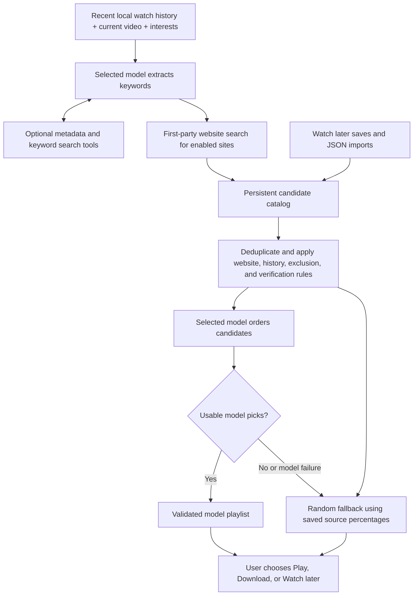

# Recommendations with your own model

ClipFeed uses the saved model configurations exposed by [The Connector](../skill/the_connector/skills.md).
Recommendations are off by default. The app records playback history locally, then
uses it with website searches and your saved **Watch later** links when you turn
the feature on. Manual search and Watch later work independently
of the AI switch and selected model.

## Setup and playback

1. Start The Connector separately. ClipFeed expects its server root at
   `http://127.0.0.1:8301`; set `RECOMMENDATION_CONNECTOR_URL` in `.env` and restart
   the backend to use another address. Do not append `/v1` to this setting.
2. Open **Recommendations** in the sidebar. The model list queries The Connector's
   active saved configurations through `GET /v1/models`. Select one and click
   **Save model**, or upload an exported routing `config.json` and click
   **Import & select**.
3. For a new library, enter up to six topics and click **Save interests**. Otherwise,
   the current video and your watch history provide the starting context.
4. In **Recommendation websites**, add a display name and domain such as
   `bilibili.tv`, `vimeo.com`, or `instagram.com`. Enable or disable sources
   individually, and remove custom websites when you no longer want them.
   YouTube and Rumble are enabled by default. Up to 12 websites can be saved.
   Custom websites can also have an optional search URL; see the examples below.
   These website choices also populate the provider selector in **Search videos**
   and My library's online search. Manual search does not require AI recommendations
   to be enabled or a model to be selected. Generic search-page results display an
   **Unverified link** label regardless of the recommendation visibility toggle.
5. Optionally save URLs in **Watch later** or use a result's **Watch later** button.
   These links can supply candidates even before you have watch history or interests.
   Review **Fallback recommendation mix** if you want to change the default
   50% website search and 50% Watch later mix.
6. Turn on **AI recommendations**, either here or in the app header.
7. Open **Swipe feed**, **Watch**, or **Watch history**. Recommendations default to
   **All enabled websites**, so watching YouTube can produce picks from Vimeo,
   Bilibili, Rumble, or any other enabled provider. Use the recommendation panel's
   website selector to restrict picks explicitly. History's website buttons only
   filter the watched-video list; they do not narrow recommendations.

When AI recommendations are enabled, completed library downloads are also tagged
in the background with 3–12 descriptive keywords derived from their title and
description. These keywords are saved locally and power the **Video topics** search
and word cloud. Turning the feature on backfills eligible existing downloads;
turning it off stops new model requests while retaining previously generated tags.

Each suggestion offers **Play** if already saved or **Download** otherwise. Downloads
also appear in **Downloads**, can run concurrently, and do not navigate away when
they finish. Select **Play** explicitly after a download completes.
Searching and requesting recommendations do not download videos automatically.
If a watched file was removed, its history entry retains the source URL and offers
**Download again**; queueing it does not navigate away from Watch history.

Verified items come from supported live source search. **Show unverified links**
is off by default. Turn it on to include model-suggested links and generic website
search results without confirmed video metadata. These
retain an **Unverified link** label, even when selected by candidate ID. Links you
explicitly save in **Watch later** are eligible with this toggle off: saving is
your curation choice, not verification. A DIY link still displays **Unverified
link** alongside **Saved by you**, unless its metadata was independently confirmed
by a supported provider. All suggestions still follow the enabled website list,
current-video, recent-history, and explicit-exclusion filters.

## Website search

In **Recommendation websites**, supply a domain and optionally a display name.
For a custom provider you can add or edit its **Search URL**. Both forms below
work; the prefix form is saved with `{query}` appended:

```text
https://vimeo.com/search?q={query}
https://vimeo.com/search?q=
```

The URL must use HTTPS on the configured domain or one of its subdomains.
Scheme-less input is normalized to HTTPS. Use exactly one `{query}` in the path
or query string; ClipFeed encodes the topic before inserting it. Credentials,
fragments, nonstandard ports, private addresses, and unrelated hosts are rejected.
Clear and save the field to return to the provider's default discovery behavior.
The UI leaves YouTube and Rumble's built-in searches unchanged.

A custom search URL retrieves public HTML or JSON/JSON-LD and extracts video
links and available titles/descriptions. It does not run website JavaScript,
sign into accounts, follow discovered video links, or download videos. Template
results remain unverified, including metadata found in JSON-LD. Sites that require
JavaScript, authentication, or block automated requests may return no usable links.
The request may follow up to five HTTP redirect responses when each destination
remains HTTPS on the configured website or one of its subdomains. Each hop is
resolved and validated before connecting, and relative result links use the final
page URL as their base. Cross-site redirects, redirect loops, and unsafe targets
remain blocked. Accidental doubled slashes at the root of a configured template are
collapsed. If a same-site redirect advertises HTTP, ClipFeed retries that target as
HTTPS and never transmits the search over plaintext. Each outbound search URL and
its response status is logged at INFO level with `External search request` and
`External search response`.

YouTube, Rumble, Vimeo, Bilibili.tv, and Bilibili.com use their own video search.
Native results contain metadata returned by the provider and can appear with
**Show unverified links** off. This confirms the source metadata, not that playback
or download will succeed in every region or account.

For every custom website search, ClipFeed uses its configured search URL, or its
native integration when one exists and no URL override is set. Without either,
keyword discovery for that website is unavailable and the UI asks for a Search
URL. No third-party search engine is queried.

Descriptions are plain text capped at 500 characters and appear on manual search
cards when supplied. They do not change a result's verification status.
Manual Search provides a **Fetch all links** toggle. Its normal mode returns the
bounded selected result set; fetch-all mode reads every anchor and structured-data
candidate on a configured search response, retains up to 200 usable same-website
video URLs, and supplies a URL as the title when an anchor has no text. Obvious
navigation, account, asset, and cross-site links remain excluded. A bounded,
concurrent metadata pass attempts to replace cryptic anchor labels with each
video page's Open Graph, Twitter, structured-data, or page title and to attach a
safe Open Graph or Twitter thumbnail from the same site or a known provider CDN.
Failed lookups retain the original title and do not remove the result.
An empty website search is a normal result, and another topic can be tried when
available. Instagram has no authenticated native search integration; results from
any usable configured search page remain unverified. Adding a
domain does not automatically create a native integration or sign into that
website. With unverified links enabled, the model can also suggest known
individual video URLs from enabled websites.
**Open original** opens the source website; **Download** uses the existing generic
yt-dlp connector, whose support and any source login requirements vary by website.

Expand **Search details** to see each searched website's candidate count and any
source-specific warning. **No matches**
means search completed without suitable links. **Search temporarily unavailable**
means a search request failed; the warning identifies the affected website. Other
websites' results remain available. **Using recent results** means
a live search failed and previously found metadata was reused. Preliminary tool
failures are not repeated after the final topic search recovers.

Custom-provider discovery shares concurrent identical searches and caches public
metadata in memory: successful searches for 90 seconds, empty searches for 20
seconds, and unavailable responses for 10 seconds. Native and custom-template
attempts have separate caches. During a temporary outage, successful metadata up
to 15 minutes old can be reused, with its verification labels preserved. Current
website, exclusion, and unverified-link settings still apply to cached results.
Caching cannot supply videos for a search that has never succeeded, and
unsupported websites remain unavailable until a Search URL or native integration
is configured.

Use the refresh button to request a new playlist. Turn the header switch off at
any time to hide suggestions and stop further recommendation steps. Results from
older settings are discarded. An upstream model or search request already sent
may finish; an already queued video download continues in Downloads.

## Watch later and JSON imports

Open **Watch later** in the sidebar to paste one video URL per line. For one URL,
you can also supply a title and description. The page accepts up to 200 videos at
once, supports filtering saved entries by website, and lets you remove entries.
**Watch later** buttons on search results and recommendations save individual
links without starting downloads. Saving remains available with AI off and for
configured websites that are currently disabled. Enable a website before its
saved videos can appear in recommendations.

Leave the optional title blank to request it from the source website in the
background. Saving returns promptly; the visible list shows **Fetching title**
and updates when the lookup completes, without resetting loaded pages. Existing
or manually supplied titles are preserved. Older untitled saves offer **Fetch
title**; failed lookups show a short explanation, **Retry title**, and an inline
field for saving a manual title. Polling stops
when no visible entries are pending or you leave the page. Direct title lookup needs
no AI model and does not download video files or change verification/origin labels.
Page-link imports ignore script/style contents, code-shaped labels, generic labels
such as **Video**, and quality/caption badges such as **1440pCC**. The importer tries
descriptive link labels and image alt text, and can use a later title link pointing
to the same URL. Title lookup also rejects badge-only results and continues to its
next source. Every saved video with an existing title offers **Attempt title fetch**
to request a replacement, including when its current label is not recognized as a
placeholder. The old title remains stored if lookup fails, with **Retry title** and
manual title entry available, and is replaced after success.
It first asks yt-dlp's provider extractor for metadata, then tries page metadata.
Optionally enable **AI title fallback** in Recommendations after selecting a
Connector model. The model receives the final video URL only when direct metadata
and page metadata cannot establish a title. Returned AI
titles are labeled **AI-generated title** and remain unverified.

Each saved item has **Play**. If the URL already has a ready local media record, the
button opens that record immediately. Otherwise it adds the URL to Downloads, shows
preparation progress, and opens the existing Watch player when the media is ready.
Failures remain on the saved card so Play can be retried or the original link opened.

Saving or importing a video also queues a thumbnail-only yt-dlp request. The worker
uses `--skip-download`, stores at most one image up to 5 MiB under the application job
root, and serves it from the saved video's thumbnail endpoint. A missing thumbnail
does not prevent the video link or title from being saved.

When a library download reaches `ready`, the matching Watch later membership is
removed automatically. Exact and canonical-equivalent URLs are matched, so provider
short links and normal watch URLs remove the same saved item. Existing ready downloads
are reconciled at backend startup. Failed and cancelled downloads remain in Watch later.

**Save every link from a page** accepts one public page URL. The backend follows at
most five separately checked HTTPS redirects and reads at most 100 MiB of HTML without
cookies, credentials, environment proxies, or scripts. It returns up to 500 unique
HTTP(S) anchor targets to a read-only preview endpoint before either collection is
changed. The review window has two views:

- **Select videos** shows every extracted link, enables checkboxes for links recognized
  as videos on configured websites, and identifies links that cannot be added directly.
- **Text view** supplies an editable one-URL-per-line list plus **Copy all page links**.
  You can edit the links in another application and paste the final list back.

**Add videos** sends up to 200 selected or pasted URLs through the normal atomic Watch
later import, including redirect resolution, title lookup, and thumbnail download.
**Archive all page links** stores all video, article, file, and ordinary page links in
the separate `watch_later_links` table. Archived links appear under **Saved page links**
and are never supplied to the recommendation model or download queue automatically.

Before the database transaction, the backend checks each submitted URL and manually
follows at most five 301, 302, 303, 307, or 308 responses. Every hop is separately
DNS-checked, uses a pinned public address, disables cookies/proxies/automatic
redirects, and must stay on a configured public HTTPS video website. The final URL
is canonicalized and deduplicated before SQLite is written. Loops, excessive hops,
invalid locations, non-video destinations, and redirects to unrelated sites are
rejected. If the initial redirect probe is temporarily unavailable, the validated
canonical input URL is retained and normal background title lookup can be retried.

The backend runs at most two title lookups at once with a bounded queue of 256
pending jobs. A full queue or unavailable website does not prevent a link from
being saved; its title status becomes unavailable and you can retry later.

The **Import a video list** section accepts a JSON array or an object with a `videos`
array. A file can contain up to 200 videos and be at most 1 MiB. Add `vimeo.com`
under Recommendation websites before importing this example:

```json
{
  "videos": [
    {
      "source_url": "https://www.youtube.com/watch?v=jNQXAC9IVRw",
      "title": "A video to revisit",
      "description": "My notes about why I saved this video."
    },
    {
      "source_url": "https://vimeo.com/76979871"
    }
  ]
}
```

Each entry requires `source_url`; `title` and `description` are optional. The API
accepts URLs up to 2,048 characters, titles up to 500, and descriptions up to
10,000. URLs must identify individual videos on configured websites. Canonical
URLs are deduplicated, and supplied titles/descriptions are stored as your
overrides without replacing independently discovered metadata. New DIY entries
start unverified. Removing an entry clears its Watch later membership and your
overrides, while preserving any other discovery origins and catalog history.

For larger files or generated lists, run the local standard-library helper:

```text
python scripts/import_watch_later.py FILE_OR_- [--api URL] [--dry-run] [--no-fetch-titles] [--no-resolve-redirects]
```

For example, from the repository root on Windows:

```powershell
.venv\Scripts\python.exe scripts\import_watch_later.py videos.json --dry-run
.venv\Scripts\python.exe scripts\import_watch_later.py videos.json --api http://127.0.0.1:8000
```

Use `.venv/bin/python` on Linux/macOS. The positional `-` reads UTF-8 JSON from
standard input. `--api` is the app's base URL, defaulting to
`http://127.0.0.1:8000`, without an `/api` suffix. The helper accepts the same JSON
shapes, up to 10,000 records or 16 MiB, and posts batches of at most 200 entries.
`--dry-run` checks the input and prints a summary without making requests; the
running app still performs website and individual-video validation on import.
Each API batch is validated before it is written. If a later batch fails, earlier
successful batches remain saved; retrying is safe because URLs are deduplicated.
Missing titles are fetched automatically after import. To store only the supplied
metadata, add `--no-fetch-titles`, or set the API request's top-level
`fetch_titles` field to `false`:

```json
{
  "videos": [{"source_url": "https://vimeo.com/76979871"}],
  "fetch_titles": false
}
```

The CLI accepts the original array/`videos` file formats; its command-line option
sets `fetch_titles` on each API batch. The UI imports fetch missing titles by default.
Redirect resolution defaults on. Use `--no-resolve-redirects`, or set the request's
top-level `resolve_redirects` field to `false`, only when you intentionally want to
store the canonical input URL without checking its HTTP redirect.

Scripts run on your own computer and send JSON through the API. The app does not
accept or execute scripts on the server. Importing stores metadata and, by default,
queues title requests. It does not download videos. It calls an AI model only when
the explicit AI title fallback setting is enabled and normal lookup failed.

## Two sources and fallback percentages

The persistent candidate catalog combines two active origins:

| Origin | UI label | Contents |
|---|---|---|
| `custom_search` | Website search | Built-in/native provider metadata and links extracted from custom search URLs |
| `watch_later` | Saved by you | URLs you saved or imported, with optional personal titles and descriptions |

One canonical video can have several origins but occupies only one playlist slot.
New discoveries are stored in SQLite and merged with saved catalog candidates on
later requests. The model ranks eligible metadata from both sources. The
catalog also records discovery counts, recommendation counts, fallback counts,
and timestamps; recommendation history is distinct from actual watch history.

**Fallback recommendation mix** applies only when the model produces no usable
picks or a model step fails. Its default is **50% website search and 50% Watch
later**. A valid nonempty model playlist keeps the model's
ordering and is not filled to these percentages. Enter whole percentages from
0 to 100 that add to 100. Zero excludes that origin from fallback selection; it
does not exclude it from normal model ranking.

Fallback randomly selects unique eligible videos, rounding the percentages to
the requested number of slots. Empty or exhausted source shares move to other
available sources with positive weights; zero-weight pools stay excluded. An
item found through multiple origins is counted once, preferring Watch later and
then website search among its positive-weight origins.
If there are too few eligible videos, the playlist can be shorter or empty.
Current videos, the latest 30 distinct watched videos, explicit exclusions,
disabled websites, and duplicates remain excluded. Unverified discoveries need
the visibility toggle; explicit Watch later saves are eligible without it and
retain their verification labels. AI recommendations must still be enabled and
a model selected: turning AI off does not start random playlists.

Fallback responses set `fallback_used: true`. Cards explain the source with
reasons such as **Random pick from Watch later**, and the panel explains that the
saved percentages were used because the model supplied no picks.

## Bring your own configuration

Upload the routing object exported by The Connector, containing `sequences`, not
the saved-record envelope with `name`, `model_id`, and `config`. For example, an
Ollama route has this shape; replace the placeholder with an installed model that
can follow the JSON prompts and supports tools if you want tool calling:

```json
{
  "sequences": [
    {"provider": "ollama", "model": "YOUR_INSTALLED_MODEL", "retries": 1}
  ]
}
```

The Connector validates the upload, and ClipFeed registers it as an active saved
configuration with a unique `recommendations-...` model ID. ClipFeed then selects
that ID without changing your on/off preference. Uploads are limited to 128 KiB.
Provider credentials and routing/effort settings belong in The Connector; credentials
are not fields in this file. A mock provider can test connectivity but does not
provide meaningful recommendations.

## Recommendation algorithm



1. Read the latest 30 distinct watched videos from SQLite, plus the current video
   and saved interests. History contains server-owned titles, source URLs,
   creators, durations, watched time, and completion state. Read saved candidates
   from the catalog as well. With no context and no catalog candidates, return
   `needs_history` and show **Add your interests** without calling the model.
2. Ask the selected model to infer one to six topics, prioritizing the current
   video and longer watch times. Require `{"keywords":["topic"]}`. During this
   stage the model may call either search tool to inspect or explore sources.
3. Search enabled websites using the topics. YouTube/Rumble use built-in searches.
   Custom websites use their template or available native search, as described
   above. Native searches receive a plain topic, with an
   alternative topic when available. Interleave topics and websites, merge origins
   by canonical video, and persist discoveries. Actual search failures become
   warnings; an empty search is a normal result. Generic-template links remain
   unverified. Previously stored catalog candidates remain available
   when current discovery cannot provide results.
4. Remove the current video, the 30 recent history entries, explicit exclusions,
   disabled/unselected websites, and duplicates. Remove unverified discoveries
   unless the toggle is enabled or the user explicitly saved the video in Watch
   later. Send bounded metadata from both origins, including descriptions
   and verification labels, to a separate ranking prompt.
5. Require an ordered `{"playlist":[{"id":"candidate-id","reason":"..."}]}`.
   Resolve candidate IDs and canonical URLs supplied as `id`, `url`, or
   `source_url`. With unverified links enabled, also accept valid individual video
   URLs on enabled websites and supported platform-qualified IDs. Otherwise,
   discard unknown entries. Unique abbreviated IDs such as `vimeo:123` resolve
   only against discovered candidates; ambiguous IDs are not guessed. When at
   least one valid model selection remains, replace unusable entries with eligible
   results, preferring verified metadata and retaining every source, watch-history,
   exclusion, and unverified setting. These replacements say **Found for your topics**.
   Routine filtering
   no longer produces a warning that entries were removed. A usable short model
   playlist is respected. If no usable picks remain, or keyword/ranking model
   calls fail, use the configured random fallback over eligible candidates.
   Return up to the requested number of suggestions, with `media_id` for any
   already downloaded video. The UI requests eight items. Record presented picks
   in recommendation history without treating them as watched, and in the shared
   link history. Recording never decides that a link is repeated. A user can choose
   **Mark repeated** on Search, Recommendations, or a row in **Settings → Link
   settings**. When hiding marked links is enabled, those user-reviewed links are
   omitted from both surfaces; explicitly allowed links remain eligible and
   excluded links remain hidden. Search also offers **Save all to Watch later** for
   every currently visible result.

The Recommendations tab stores a separate **Fetch all links** preference. When it
is on, final topic discovery collects up to 200 usable links per configured search
page into the local candidate catalog. The model still receives at most 48 bounded
ranking candidates, and all existing website, verification, exclusion, repeated-
link, watch-history, and source filters continue to apply. The default selected-
link mode remains bounded to 24 links per provider attempt.

The model determines relevance and ordering; this is not a trained collaborative
filter. It receives the current request's context through stateless Chat
Completions. Full assistant messages, including provider replay metadata, are
preserved across tool turns, and each tool result uses the matching `tool_call_id`.
This follows the Connector contract and the
[Chat Completions tool loop](https://developers.openai.com/api/docs/guides/function-calling).

The keyword stage allows four model turns and at most four tool calls, including
bounded retries for malformed keyword JSON. Both stages accept plain JSON or JSON
inside a single Markdown code fence. If the ranking response is malformed or
truncated, the app asks for a corrected playlist once, increasing the output token
budget from 1,800 to 4,096. The retry uses the same eligible candidates without
repeating searches. When model steps fail, available context can supply topics
and eligible catalog/discovery results can supply the weighted fallback. A model
error is shown with retry controls if no eligible fallback can be produced.
Identical concurrent requests share work; completed results are cached for 90
seconds, keyed by settings, history, current video, and exclusions. Refresh skips
the completed cache. Timeouts, size limits, and settings checks bound requests;
changing the configuration invalidates pending results.

## Search tool contracts

Tools are advertised as OpenAI-compatible function schemas through
`GET /api/recommendations/tools` and included in keyword-stage model requests.
They return metadata only.

| Tool | Arguments | Result |
|---|---|---|
| `search_by_url` | `{"url":"https://www.youtube.com/watch?v=jNQXAC9IVRw"}` | One video: `id`, `source_url`, `title`, `connector`, `uploader`, `duration`, `thumbnail_url`, `verified`, and available `description`/`origins` |
| `search_by_key_words` | `{"keywords":["space exploration","astronomy"],"limit":12}` | `{ "results": [...], "warnings": [...], "sources": [...] }` with round-robin platform results |

`search_by_url` accepts individual video URLs on enabled websites, including
scheme-less URLs such as `youtube.com/watch?v=jNQXAC9IVRw`. It rejects unrelated
hosts and recognizable channel/search links. YouTube/Rumble metadata is read using
yt-dlp; custom-site lookups use direct extractor or page metadata and remain
unverified unless a native provider confirms them.
`search_by_key_words` accepts one to six topics,
each at most 100 characters, with a result limit from 1 to 24. Direct HTTP tool
invocation requires recommendations to be enabled:

```http
POST /api/recommendations/tools/search_by_key_words
Content-Type: application/json

{"arguments":{"keywords":["space exploration"],"limit":12}}
```

## API and storage

| Method | Endpoint | Purpose |
|---|---|---|
| GET / PATCH | `/api/settings/links` | List recorded links and configure whether user-marked repeated links are hidden |
| PATCH | `/api/settings/links/{link_id}` | Mark a link `silenced` (repeated), `allowed`, or `excluded` |
| GET / PATCH | `/api/recommendations/settings` | Read/change `enabled`, `model_id`, `seed_keywords`, `allow_unverified_links`, `allow_ai_title_lookup`, `fetch_all_search_links`, `providers`, and `fallback_weights` |
| GET | `/api/recommendations/models` | Discover active Connector configurations |
| POST | `/api/recommendations/configs` | Validate and register `{name, config}` with The Connector |
| GET | `/api/recommendations/tools` | Read function schemas |
| POST | `/api/recommendations/tools/{name}` | Invoke a search tool using `{arguments}` |
| POST | `/api/recommendations` | Generate `{context, source, video_id, exclude_urls, limit, refresh}` |
| GET | `/api/recommendations/watch-later?source=all&limit=200&offset=0` | List saved entries as `{items, total, revision}`; `limit` is 1–200 |
| POST | `/api/recommendations/watch-later` | Save/import `{videos:[{source_url,title?,description?}], fetch_titles?:true, resolve_redirects?:true}` (1–200 entries); return `{items, added, updated, revision}` |
| POST | `/api/recommendations/watch-later/{catalog_id}/title` | Queue/retry a missing title; `?force=true` refreshes an existing title; return `{item, queued}` (200), or 404 if no longer saved |
| GET | `/api/recommendations/watch-later/{catalog_id}/thumbnail` | Serve the locally downloaded thumbnail for a saved video |
| DELETE | `/api/recommendations/watch-later/{catalog_id}` | Remove Watch later membership; return `{removed, revision}` |
| GET | `/api/recommendations/watch-later/links?limit=200&offset=0` | List non-video-capable page links saved by bulk page import |
| POST | `/api/recommendations/watch-later/preview-links` | Fetch `{page_url}` and return up to 500 links annotated with `is_video`, `video_url`, and `provider` without saving |
| POST | `/api/recommendations/watch-later/save-all-links` | Fetch `{page_url}` and save up to 500 unique HTTP(S) links from its HTML |
| DELETE | `/api/recommendations/watch-later/links/{link_id}` | Remove one saved page link |
| GET | `/api/watch-history?limit=30` | Read recent local watch-history snapshots |
| POST | `/api/watch-history` | Record `{video_id, position_seconds, watched_seconds, completed}` |

Recommendation responses contain `status` (`ready`, `disabled`, or `needs_history`),
`items`, `keywords`, `warnings`, `sources`, and `fallback_used`. Each searched source reports its
`id`, `name`, `status` (`ok`, `empty`, `unavailable`, or `cached`), candidate `count`,
`discovery` (`provider_search` or `custom_search`), and `warnings`. Custom
sites can also report a `channels` array with each origin's status, count,
discovery type, and warnings. Reused results can include `cache_age_seconds`.
Counts describe discovered candidates before
playlist filtering and ranking. Context is `feed`, `watch`, or `history`; source
is `all` or an enabled provider ID; `video_id` is a local library ID. Built-in
provider IDs are `youtube` and `rumble`; custom IDs are canonical domains such as
`vimeo.com`. Request limits range from 1 to 20. Items preserve `origins`,
`user_added`, and `verified`; saved entries have an integer `catalog_id`.
Random fallback items include `fallback_source` and their source-specific reason.
Model errors that cannot be served by fallback are displayed with retry controls.

Watch later items include `title_fetch_status` (`idle`, `pending`, `ready`, or
`unavailable`), nullable `title_fetch_error`, and nullable `title_fetch_method`
(`source` or `ai`). They also include nullable `media_id` when the same canonical URL
already has a ready local download. Supplied/existing titles need no
lookup and can remain `idle`; `ready` means a title lookup succeeded, not that the
video is verified. `GET` returns the latest title/status. Import requests default
to `fetch_titles: true`; `false` stores the provided metadata without queueing a
title lookup. `resolve_redirects` also defaults to `true` and resolves the final
canonical configured-video URL before insertion. Successful title changes advance the recommendation revision, and
the Watch later page refreshes shared settings when it observes a changed title.

`providers` is a replacement list of `{id, name, domain, enabled, search_url?}` objects. Domains
are normalized to lowercase without `www.`; homepage URLs are also accepted.
Duplicates, overlapping parent/subdomain entries, IP addresses, local/reserved
domains, credentials, paths, and ports are rejected. An empty list disables all
websites. Provider changes persist in
SQLite and invalidate cached and pending recommendations. Existing databases
receive the default YouTube/Rumble list without changing other preferences.
`search_url` can be omitted or set to `null`/an empty string to use default discovery.
For example, this settings patch changes only the fallback percentages:

```json
{
  "fallback_weights": {
    "custom_search": 50,
    "public_search": 0,
    "watch_later": 50
  }
}
```

Weights must be integers between 0 and 100 with a total of 100. `public_search` is
retained as a compatibility field and must be 0. Watch later saves
and removals increment the recommendation revision and invalidate pending/cached
playlists. They do not restart an unchanged manual video search.

Watch time measures actual foreground playback, excluding pauses, buffering,
seeks, and preloaded feed items. Events flush periodically and when playback
pauses, ends, changes videos, or leaves the page. The backend validates deltas and
obtains metadata from its own library records. Snapshots remain after a library
video is deleted so that removing its file does not erase its recommendation
context.

Preferences, history, and the candidate catalog share the existing SQLite database, defaulting to
`%TEMP%\prod_jobs\jobs.db`; downloaded recommendations use
`%TEMP%\prod_jobs\library`. The existing storage environment overrides apply.
System temporary-file cleanup may remove these files. The Connector maintains
its own saved configurations and request history in its separate installation.

The catalog uses `recommendation_websites` for website configuration,
`recommendation_videos` for canonical metadata and your optional overrides,
`recommendation_video_origins` for discovery/Watch later provenance, and
`recommendation_history` for previously presented picks. `recommendation_settings`
holds the model preferences, provider list, fallback weights, and revision;
`watch_history` records actual playback. Removing a provider marks its catalog
website inactive instead of deleting its records, so re-adding it can reuse them.

When enabled, history metadata, saved candidate titles/descriptions, and search results are sent through The Connector
to the providers selected in your configuration. Video files are not sent to the
model. Native discovery sends derived topics to the enabled website's own search.
Custom search URLs receive the encoded topic. No third-party search engine receives
the website domain or topics. Turning
recommendations off stops recommendation requests; local playback
history continues to be recorded.

## Verification

Offline backend tests cover discovery/import, settings races, tool validation,
round-robin search, full tool-message replay, history persistence, candidate
filtering, malformed/truncated response recovery, safe Connector error messages,
stale results, caching, concurrent requests, provider persistence and migration,
custom-domain validation, native/template search parsing, combined discovery
origins and empty channels, unverified link aliases and provenance, ranking
recovery, and toggle changes. Catalog and import tests cover deduplication,
metadata preservation, explicit curation, atomic API batches, and persistence.
Weighted fallback tests cover model failures/empty playlists, rounding,
zero-weight exclusion, depleted pools, and existing eligibility filters.
Search resilience tests cover cache expiration, stale-result age limits,
concurrent searches, caller cancellation, native recovery, partial source
failures, and diagnostics after a successful retry.
Browser tests cover
model selection, uploads, playback history, empty-feed suggestions, download and
playback actions, errors, disabling during a pending recommendation, custom
website management and search URLs, cross-site Watch/history recommendations,
independent source filters, unverified recommendation cards, per-source search
details, fallback percentages, Watch later saves/removal/import, and keeping
manual search results intact after saving. CLI checks use local fake API responses
for file/stdin input, dry runs, batching, validation, and partial failures. Browser
title-lookup checks cover pending/ready transitions, preserving supplied titles,
plain-text failures and retries, polling paginated lists, and ignoring responses
after a source change or leaving the page.

Live checks verified discovery against the local Connector and video metadata
lookup on YouTube and Rumble. Native searches were checked live against Vimeo,
Bilibili.tv, and Bilibili.com. A combined keyword search returned six interleaved
results from these three websites, all with provider-confirmed metadata and no
warnings. Custom search URL
HTML/JSON-LD extraction and request restrictions are tested with offline fixtures,
not live arbitrary websites. Successful native probes do not establish that a
custom template or every configured website will work.
Search-service bot protection was observed and is handled as a search warning.
One authorized recommendation request reproduced a
model response that failed playlist JSON validation. Recovery and error handling
are covered by offline tests using controlled model responses; recommendation
quality has not been evaluated. Actual relevance and tool support depend on the
selected model and configuration.

## Troubleshooting a 502 response

`POST /api/recommendations` can return 502 when a model response or upstream
request cannot be used and no eligible fallback is available. If catalog or
discovery candidates can satisfy the fallback rules, the app instead returns
those random picks with an explanation. Read any error in the panel or the response
body's `detail` field. The backend also logs a sanitized reason and, when available,
the Connector's HTTP status. It does not log watch history or raw model replies.

- **Invalid JSON playlist:** the model did not follow the requested format, even
  after one repair attempt. Retry or choose another configuration in Recommendations.
- **Response token limit:** the model could not finish within the output budget.
  Choose a configuration with lower reasoning effort or another model.
- **Connection, timeout, credentials, or rate limit:** check the specific message
  and the Connector's provider settings. A working model list confirms discovery,
  but does not guarantee that a provider can complete a recommendation request.

Successful `/api/watch-history` requests only confirm local history storage; model
generation uses a separate request and can fail independently.
