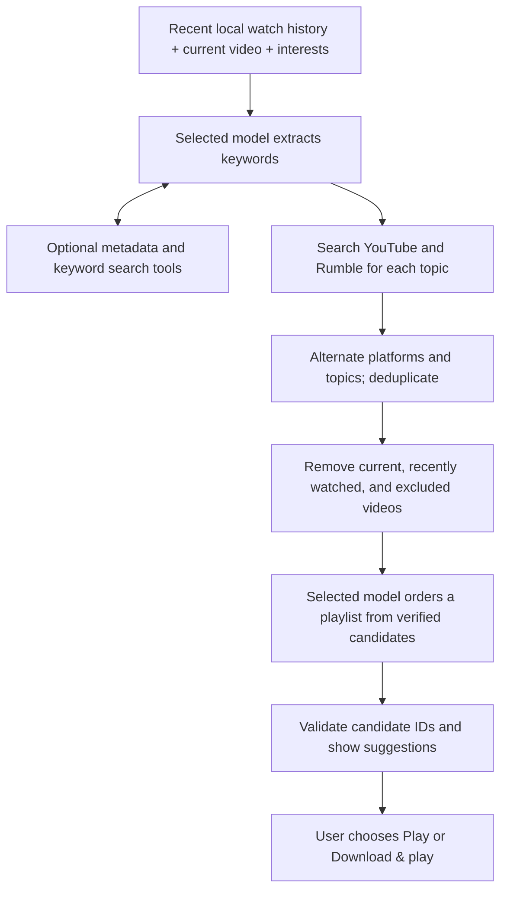

# Recommendations with your own model

ClipFeed uses the saved model configurations exposed by [The Connector](../skill/the_connector/skills.md).
Recommendations are off by default. The app records playback history locally, then
uses that history for recommendations only when you turn the feature on.

## Setup and playback

1. Start The Connector separately. ClipFeed expects its server root at
   `http://127.0.0.1:8301`; set `RECOMMENDATION_CONNECTOR_URL` in `.env` and restart
   the backend to use another address. Do not append `/v1` to this setting.
2. Open **Recommendations** in the sidebar. The model list queries The Connector's
   active saved configurations through `GET /v1/models`. Select one and click
   **Save model**, or upload an exported routing `config.json` and click
   **Import & select**.
3. For a new library, enter up to six topics and click **Save interests**. Otherwise,
   the current video and your watch history provide the starting context.
4. Turn on **AI recommendations**, either here or in the app header.
5. Open **Swipe feed** or **Watch**. Suggestions appear in an empty feed, at the
   last saved feed item, and alongside Watch's existing **Up next** list.

Each suggestion offers **Play** if already saved or **Download & play** otherwise.
The latter queues the normal download, shows its progress, and opens the video in
the current viewing mode when ready. Downloads also appear in **Downloads**.
Searching and requesting recommendations do not download videos automatically.

Use the refresh button to request a new playlist. Turn the header switch off at
any time to hide suggestions and stop further recommendation steps. Results from
older settings are discarded. An upstream model or search request already sent
may finish; an already queued video download continues in Downloads.

## Bring your own configuration

Upload the routing object exported by The Connector, containing `sequences`, not
the saved-record envelope with `name`, `model_id`, and `config`. For example, an
Ollama route has this shape; replace the placeholder with an installed model that
can follow the JSON prompts and supports tools if you want tool calling:

```json
{
  "sequences": [
    {"provider": "ollama", "model": "YOUR_INSTALLED_MODEL", "retries": 1}
  ]
}
```

The Connector validates the upload, and ClipFeed registers it as an active saved
configuration with a unique `recommendations-...` model ID. ClipFeed then selects
that ID without changing your on/off preference. Uploads are limited to 128 KiB.
Provider credentials and routing/effort settings belong in The Connector; credentials
are not fields in this file. A mock provider can test connectivity but does not
provide meaningful recommendations.

## Recommendation algorithm



1. Read the latest 30 distinct watched videos from SQLite, plus the current video
   and saved interests. History contains server-owned titles, source URLs,
   creators, durations, watched time, and completion state. With none of these
   inputs, return `needs_history` and show **Add your interests** without calling
   the model.
2. Ask the selected model to infer one to six topics, prioritizing the current
   video and longer watch times. Require `{"keywords":["topic"]}`. During this
   stage the model may call either search tool to inspect or explore sources.
3. Search both platforms for each topic. Interleave topics and alternate YouTube
   and Rumble results, removing duplicates. If one platform has fewer results,
   fill the remaining positions from the other. Partial failures become warnings.
4. Remove the current video, the 30 recent history entries, explicit exclusions,
   and duplicates. Send the remaining verified metadata to the model with a
   separate ranking prompt.
5. Require an ordered `{"playlist":[{"id":"candidate-id","reason":"..."}]}`.
   Accept only IDs or exact URLs from the supplied candidate set; discard invented
   entries. Return up to the requested number of suggestions, with `media_id` for
   any already saved video. The UI requests eight items.

The model determines relevance and ordering; this is not a trained collaborative
filter. It receives the current request's context through stateless Chat
Completions. Full assistant messages, including provider replay metadata, are
preserved across tool turns, and each tool result uses the matching `tool_call_id`.
This follows the Connector contract and the
[Chat Completions tool loop](https://developers.openai.com/api/docs/guides/function-calling).

The keyword stage allows four model turns and at most four tool calls, including
bounded retries for malformed keyword JSON. Both stages accept plain JSON or JSON
inside a single Markdown code fence. If the ranking response is malformed or
truncated, the app asks for a corrected playlist once, increasing the output token
budget from 1,800 to 4,096. The retry uses the same verified candidates without
repeating searches. Persistent errors are shown with retry controls.
Identical concurrent requests share work; completed results are cached for 90
seconds, keyed by settings, history, current video, and exclusions. Refresh skips
the completed cache. Timeouts, size limits, and settings checks bound requests;
changing the configuration invalidates pending results.

## Search tool contracts

Tools are advertised as OpenAI-compatible function schemas through
`GET /api/recommendations/tools` and included in keyword-stage model requests.
They return metadata only.

| Tool | Arguments | Result |
|---|---|---|
| `search_by_url` | `{"url":"https://www.youtube.com/watch?v=jNQXAC9IVRw"}` | One video: `id`, `source_url`, `title`, `connector`, `uploader`, `duration`, `thumbnail_url` |
| `search_by_key_words` | `{"keywords":["space exploration","astronomy"],"limit":12}` | `{ "results": [...], "warnings": [...] }` with round-robin platform results |

`search_by_url` accepts individual YouTube or Rumble video URLs, including
scheme-less URLs such as `youtube.com/watch?v=jNQXAC9IVRw`. It rejects unrelated
hosts and channel/search links. `search_by_key_words` accepts one to six topics,
each at most 100 characters, with a result limit from 1 to 24. Direct HTTP tool
invocation requires recommendations to be enabled:

```http
POST /api/recommendations/tools/search_by_key_words
Content-Type: application/json

{"arguments":{"keywords":["space exploration"],"limit":12}}
```

## API and storage

| Method | Endpoint | Purpose |
|---|---|---|
| GET / PATCH | `/api/recommendations/settings` | Read/change `enabled`, `model_id`, and `seed_keywords` |
| GET | `/api/recommendations/models` | Discover active Connector configurations |
| POST | `/api/recommendations/configs` | Validate and register `{name, config}` with The Connector |
| GET | `/api/recommendations/tools` | Read function schemas |
| POST | `/api/recommendations/tools/{name}` | Invoke a search tool using `{arguments}` |
| POST | `/api/recommendations` | Generate `{context, video_id, exclude_urls, limit, refresh}` |
| GET | `/api/watch-history?limit=30` | Read recent local watch-history snapshots |
| POST | `/api/watch-history` | Record `{video_id, position_seconds, watched_seconds, completed}` |

Recommendation responses contain `status` (`ready`, `disabled`, or `needs_history`),
`items`, `keywords`, and `warnings`. Context is `feed` or `watch`; `video_id` is a
local library ID. Request limits range from 1 to 20. Tool and model errors are
displayed with retry controls.

Watch time measures actual foreground playback, excluding pauses, buffering,
seeks, and preloaded feed items. Events flush periodically and when playback
pauses, ends, changes videos, or leaves the page. The backend validates deltas and
obtains metadata from its own library records. Snapshots remain after a library
video is deleted so that removing its file does not erase its recommendation
context.

Preferences and history share the existing SQLite database, defaulting to
`%TEMP%\prod_jobs\jobs.db`; downloaded recommendations use
`%TEMP%\prod_jobs\library`. The existing storage environment overrides apply.
System temporary-file cleanup may remove these files. The Connector maintains
its own saved configurations and request history in its separate installation.

When enabled, history metadata and search results are sent through The Connector
to the providers selected in your configuration. Video files are not sent to the
model. Turning recommendations off stops recommendation requests; local playback
history continues to be recorded.

## Verification

Offline backend tests cover discovery/import, settings races, tool validation,
round-robin search, full tool-message replay, history persistence, candidate
filtering, malformed/truncated response recovery, safe Connector error messages,
stale results, caching, and concurrent requests. Browser tests cover
model selection, uploads, playback history, empty-feed suggestions, download and
playback actions, errors, and disabling during a pending recommendation.

Live checks verified discovery against the local Connector and video metadata
lookup on YouTube and Rumble. One authorized recommendation request reproduced a
model response that failed playlist JSON validation. Recovery and error handling
are covered by offline tests using controlled model responses; recommendation
quality has not been evaluated. Actual relevance and tool support depend on the
selected model and configuration.

## Troubleshooting a 502 response

`POST /api/recommendations` returns 502 when a model response or an upstream
request cannot be used. Read the error in the recommendation panel or the response
body's `detail` field. The backend also logs a sanitized reason and, when available,
the Connector's HTTP status. It does not log watch history or raw model replies.

- **Invalid JSON playlist:** the model did not follow the requested format, even
  after one repair attempt. Retry or choose another configuration in Recommendations.
- **Response token limit:** the model could not finish within the output budget.
  Choose a configuration with lower reasoning effort or another model.
- **Connection, timeout, credentials, or rate limit:** check the specific message
  and the Connector's provider settings. A working model list confirms discovery,
  but does not guarantee that a provider can complete a recommendation request.

Successful `/api/watch-history` requests only confirm local history storage; model
generation uses a separate request and can fail independently.
